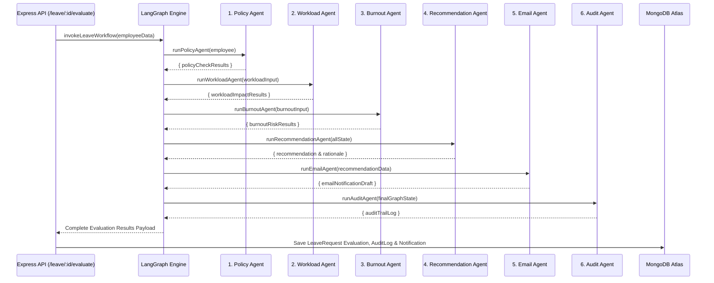

# HR Flow AI — Agents & Custom Skills Specification

This document provides technical documentation for the **6 custom AI agents** implemented in `agents/`, their orchestration inside the **LangGraph multi-agent workflow** (`graph/graph.js`), and the project's **custom agent skill** definition.

---

## Part 1: Custom AI Agents

### 1. Policy Agent (`agents/policyAgent.js`)
- **Purpose:** Validates employee leave applications against uploaded company policy guidelines and department-specific rules.
- **Position in LangGraph:** Node 1 (Initial graph execution node following `START`).
- **Inputs:** `employee` object containing `{ name, department, leaveType, days }`.
- **Outputs:** `{ applicablePolicy, policyExplanation, isCompliant }`.
- **Responsibilities:**
  1. Dynamically queries the latest active policy document stored in MongoDB Atlas via `tools/policyTool.js`.
  2. Evaluates requested leave days against maximum allowed days per request and annual limits.
  3. Checks department-specific approval requirements and advance notice rules.
  4. Formulates a transparent, human-readable policy compliance explanation.

---

### 2. Workload Agent (`agents/workloadAgent.js`)
- **Purpose:** Analyzes the staffing impact and team capacity of granting a requested leave application.
- **Position in LangGraph:** Node 2 (Executes after Policy Agent node).
- **Inputs:** `{ department, teamSize, employeesOnLeave }`.
- **Outputs:** `{ currentCoveragePercent, projectRisk, staffingImpact, recommendationScore }`.
- **Responsibilities:**
  1. Calculates remaining department staffing coverage percentage when requested leave is active.
  2. Compares coverage percentage against department safety thresholds (e.g., minimum 75% coverage).
  3. Evaluates project risk levels (`LOW`, `MEDIUM`, `HIGH`) based on concurrent absences.
  4. Provides a numeric workload recommendation score.

---

### 3. Burnout Agent (`agents/burnoutAgent.js`)
- **Purpose:** Assesses employee burnout risk by analyzing accumulated work hours, unused leave, and weekend labor patterns.
- **Position in LangGraph:** Node 3 (Executes after Workload Agent node).
- **Inputs:** `{ overtime, unusedLeave, weekendWork }`.
- **Outputs:** `{ burnoutScore, riskLevel, burnoutRationale, suggestedAction }`.
- **Responsibilities:**
  1. Computes an empirical burnout risk score based on recent overtime hours, unused annual leave balances, and weekend shifts worked.
  2. Classifies burnout risk into levels (`LOW`, `MODERATE`, `HIGH`, `CRITICAL`).
  3. Identifies fatigue factors and generates proactive wellness recommendations (e.g., strongly encouraging rest for high-overtime employees).

---

### 4. Recommendation Agent (`agents/recommendationAgent.js`)
- **Purpose:** Synthesizes analysis from the Policy, Workload, and Burnout agents into a unified, explainable recommendation.
- **Position in LangGraph:** Node 4 (Executes after Burnout Agent node).
- **Inputs:** `{ employee, policy, workload, burnout }`.
- **Outputs:** `{ decision, confidenceScore, reason, summary, riskFlags }`.
- **Responsibilities:**
  1. Combines findings from all upstream agent evaluation nodes.
  2. Formulates a structured decision recommendation (`APPROVED`, `FLAGGED`, `REJECTED`).
  3. Assigns an AI confidence score (e.g., 85%-95%).
  4. Generates a multi-factor explanation justifying why the leave request should be approved, rejected, or flagged for HR review.

---

### 5. Email Agent (`agents/emailAgent.js`)
- **Purpose:** Drafts personalized, professional email communications for the applicant employee.
- **Position in LangGraph:** Node 5 (Executes after Recommendation Agent node).
- **Inputs:** `{ employeeName, decision, reason, leaveType, days }`.
- **Outputs:** `{ recipient, subject, bodyDraft, status }`.
- **Responsibilities:**
  1. Formulates a clear, professional email subject line.
  2. Constructs a detailed email body containing the recommendation summary and next steps for the employee.
  3. Sets notification status (`GENERATED`).

---

### 6. Audit Agent (`agents/auditAgent.js`)
- **Purpose:** Compiles a complete, immutable compliance audit record for governance and reporting.
- **Position in LangGraph:** Node 6 (Final node executing before graph `END`).
- **Inputs:** Full graph state containing `{ employee, policy, workload, burnout, recommendation, email }`.
- **Outputs:** `{ auditId, timestamp, complianceSummary, riskAuditTrail }`.
- **Responsibilities:**
  1. Extracts key metrics, policy check status, workload coverage scores, and burnout risk ratings.
  2. Constructs a structured audit details payload.
  3. Prepares an audit entry to be persisted in MongoDB Atlas under the `AuditLog` collection.

---

## Part 2: LangGraph Agent Sequence Diagram

---

## Part 3: Custom Agent Skill Specification

### Custom Skill: `hr-compliance-evaluator`

- **Path:** [skills/hr-compliance-evaluator/SKILL.md](file:///c:/Users/KIIT/Desktop/HR%20Flow%20AI/skills/hr-compliance-evaluator/SKILL.md)
- **Purpose:** Defines a reusable, standardized procedure for evaluating employee leave requests against active company HR policy, team workload capacity, and employee fatigue metrics, producing an explainable recommendation and audit log while preserving human-in-the-loop decision-making.
- **Inputs:**
  - `employee` (`name`, `employeeId`, `department`)
  - Leave application details (`leaveType`, `days`)
  - Active HR policy extracted from MongoDB (`maxConsecutiveLeaveDays`, `allowedLeaveTypes`, notice rules)
  - Workload context (`teamSize`, `employeesOnLeave`)
  - Burnout context (`overtime`, `unusedLeave`, `weekendWork`)
- **Procedure:**
  1. Load active company policy via `Policy.findOne({ isLatest: true })` or `tools/policyTool.js`.
  2. Identify relevant policy rules matching requested leave type and days.
  3. Inspect leave request for required parameters.
  4. Evaluate policy compliance (`policyAgent`).
  5. Consider workload coverage (`workloadAgent`) and burnout risk signals (`burnoutAgent`).
  6. Produce structured evaluation findings.
  7. Provide evidence and explanation rationale (`recommendationAgent`).
  8. Produce recommendation decision (`APPROVED`, `FLAGGED`, `REJECTED`).
  9. Record audit trail (`auditAgent`).
  10. Return control to human HR decision workflow (`POST /leave/:id/decision`).
- **Outputs:** Structured evaluation JSON containing `{ policyCheck, workloadAnalysis, burnoutAnalysis, recommendation, email, audit }`.
- **Integration Point:** Triggered inside the Express handler for `POST /leave/:id/evaluate` via `executeLeaveWorkflow(employeeData)` in `graph/graph.js`.
- **Safety Boundaries:**
  - MUST NOT invent company policies.
  - MUST NOT fabricate evidence or mock data in production paths.
  - MUST NOT automatically approve or reject leave requests (request status remains `"PENDING"`).
  - MUST NOT bypass HR authorization or expose private employee data.
