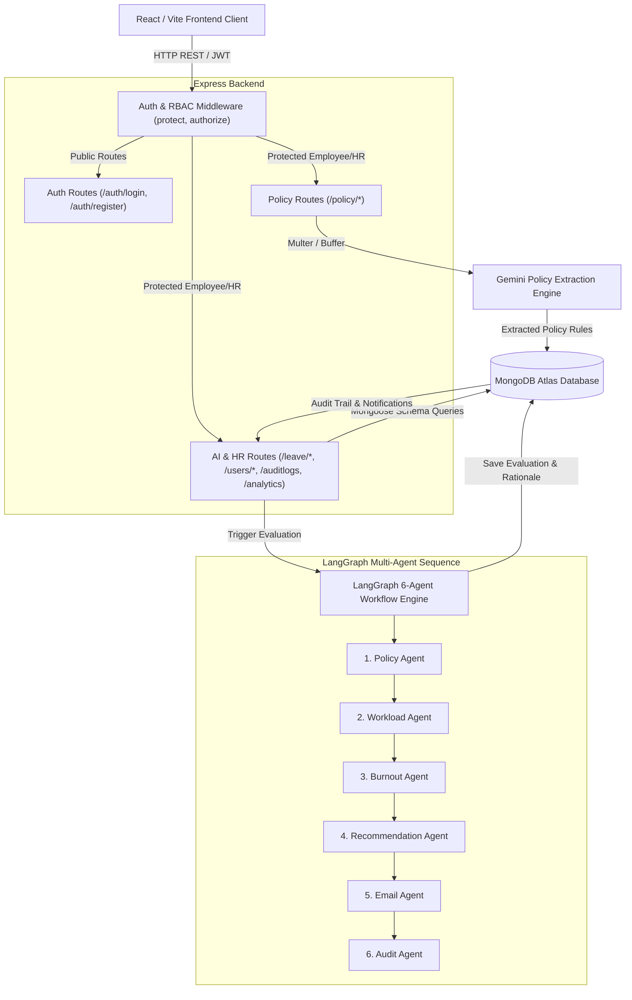
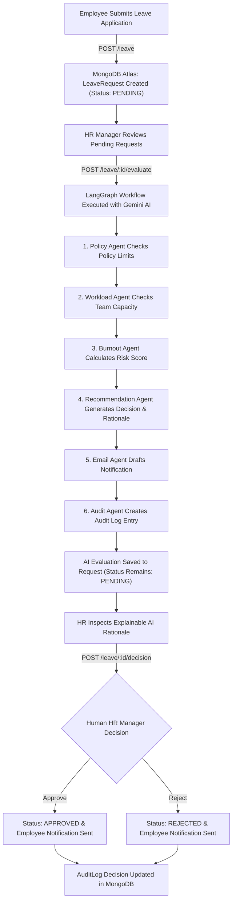

# HR Flow AI — System Architecture Document

## 1. Product Overview

**HR Flow AI** is an intelligent, multi-agent AI enterprise HR management system designed to automate leave evaluation, workload impact analysis, burnout risk assessment, and policy compliance verification while retaining human-in-the-loop HR oversight.

The system combines an Express.js REST API, a React/Vite frontend interface, a MongoDB Atlas persistence layer, and a 6-agent LangGraph workflow powered by Google Gemini 2.5 Flash.

---

## 2. Technology Stack

- **Frontend Framework:** React 19, Vite 8, Lucide React icons, Vanilla CSS (Design system with custom CSS tokens).
- **Backend Framework:** Node.js (ES Modules), Express 4.21.
- **Database & Modeling:** MongoDB Atlas, Mongoose 9.9 (with local MongoDB fallback mechanism).
- **Multi-Agent Orchestration:** LangGraph (`@langchain/langgraph` v0.2.40), `@langchain/core`.
- **AI Infrastructure:** Google Gemini 2.5 Flash (`@google/genai`, `@langchain/google-genai`).
- **Authentication & Security:** JSON Web Tokens (`jsonwebtoken`), password hashing via `bcryptjs`, Role-Based Access Control (RBAC) middleware.
- **File Ingestion:** Multer (memory storage for PDF/DOCX policy upload).

---

## 3. High-Level Architecture Diagram

---

## 4. End-to-End Employee Leave & HR Decision Workflow

---

## 5. API Architecture & Endpoint Specification

### Public Endpoints
- `POST /auth/register`: Public employee registration (blocks public HR role creation).
- `POST /auth/login`: Authenticate Employee or HR user and issue JWT token.
- `GET /health`: System health check endpoint.

### Employee & HR Protected Endpoints (`protect`, `authorize("employee", "hr")`)
- `GET /auth/profile`: Fetch current user profile.
- `GET /policy/latest`: Retrieve active company HR policy and rules.
- `POST /leave`: Submit new employee leave application (`status: PENDING`).
- `GET /leave/requests`: Retrieve leave requests (Employees view own requests; HR views all).
- `GET /leave/requests/:id`: Retrieve leave request details (Employees restricted to own ID).
- `GET /notifications`: Retrieve notification emails (Employees restricted to own recipient email).
- `POST /chat`: Interactive HR Chatbot powered by Google Gemini 2.5 Flash.

### HR-Only Protected Endpoints (`protect`, `authorize("hr")`)
- `POST /policy/upload`: Upload policy document (PDF/DOCX/Text) and extract rules via Gemini AI.
- `GET /policy/all`: View history of all uploaded company policy versions.
- `GET /users/employees`: List all registered employee accounts for management.
- `PATCH /users/employees/:id`: Edit employee details (department, overtime, unused leave, weekend work).
- `DELETE /users/employees/:id`: Remove an employee account.
- `POST /leave/:id/evaluate`: Trigger 6-agent LangGraph workflow execution for pending leave request.
- `POST /leave/:id/decision`: Confirm human HR decision (`APPROVED`, `REJECTED`, `FLAGGED`, `REQUEST_CHANGES`).
- `PATCH /leave/requests/:id/status`: Alias endpoint for HR decision confirmation.
- `GET /auditlogs`: Access complete compliance audit logs.
- `GET /analytics`: Retrieve dashboard analytics, department leave distribution, and burnout metrics.

---

## 6. Database Data Models (MongoDB Atlas / Mongoose)

### 1. User Model (`User.js`)
- `name` (String, required)
- `employeeId` (String, default format `EMP-XXXX`)
- `email` (String, required, unique, lowercase)
- `password` (String, required, hashed via bcryptjs)
- `role` (String, enum: `["employee", "hr"]`, default: `"employee"`)
- `department` (String, required)
- `overtime` (Number, default: 0)
- `unusedLeave` (Number, default: 0)
- `weekendWork` (Number, default: 0)
- `timestamps` (createdAt, updatedAt)

### 2. LeaveRequest Model (`LeaveRequest.js`)
- `userId` (ObjectId ref User)
- `employeeName` (String, required)
- `department` (String, required)
- `leaveType` (String, required)
- `days` (Number, required)
- `teamSize` (Number, default: 1)
- `employeesOnLeave` (Number, default: 0)
- `overtime` (Number, default: 0)
- `unusedLeave` (Number, default: 0)
- `weekendWork` (Number, default: 0)
- `policyCheck` (Mixed: policy compliance findings)
- `workloadAnalysis` (Mixed: capacity findings)
- `burnoutAnalysis` (Mixed: risk findings)
- `recommendation` (Mixed: decision, confidence score, rationale)
- `email` (Mixed: notification recipient, subject, body draft)
- `status` (String, enum: `["APPROVED", "REJECTED", "FLAGGED", "PENDING"]`, default: `"PENDING"`)
- `timestamps` (createdAt, updatedAt)

### 3. Policy Model (`Policy.js`)
- `title` (String, required)
- `fileName` (String, required)
- `fileType` (String, default: `"PDF"`)
- `rawContent` (String, required)
- `extractedRules` (Object: `companyName`, `maxConsecutiveLeaveDays`, `minNoticeDaysRequired`, `maxLeavePerYear`, `probationLeaveRestriction`, `allowedLeaveTypes`, `policySummary`)
- `uploadedBy` (String, default: `"HR Admin"`)
- `isLatest` (Boolean, default: true)
- `timestamps` (createdAt, updatedAt)

### 4. AuditLog Model (`AuditLog.js`)
- `leaveRequestId` (ObjectId ref LeaveRequest, required)
- `employeeName` (String, required)
- `action` (String, default: `"LEAVE_EVALUATION"`)
- `decision` (String)
- `policyCompliance` (Mixed)
- `workloadImpact` (Mixed)
- `burnoutRisk` (Mixed)
- `auditDetails` (Mixed)
- `timestamp` (Date, default: `Date.now`)

### 5. Notification Model (`Notification.js`)
- `leaveRequestId` (ObjectId ref LeaveRequest, required)
- `recipient` (String, required)
- `subject` (String, required)
- `body` (String, required)
- `status` (String, enum: `["GENERATED", "PENDING", "SENT", "FAILED"]`, default: `"GENERATED"`)
- `sentAt` (Date, default: `Date.now`)

---

## 7. Multi-Agent LangGraph Architecture

The LangGraph workflow (`graph/graph.js`) orchestrates 6 domain-specific AI agents using a `StateGraph`:

1. **Policy Agent (`policyAgent.js`):** Validates requested leave days against active MongoDB company policies and departmental thresholds.
2. **Workload Agent (`workloadAgent.js`):** Evaluates active team size, current team members on leave, and remaining coverage percentage.
3. **Burnout Agent (`burnoutAgent.js`):** Calculates an empirical burnout risk score based on accumulated overtime hours, unused leave days, and weekend shifts worked.
4. **Recommendation Agent (`recommendationAgent.js`):** Synthesizes policy compliance, workload impact, and burnout risk into a structured decision recommendation (`APPROVED`, `FLAGGED`, `REJECTED`) with explainable rationale.
5. **Email Agent (`emailAgent.js`):** Generates personalized notification communication drafts for employees.
6. **Audit Agent (`auditAgent.js`):** Compiles complete audit records and compliance logs for governance tracking.

---

## 8. Security & Compliance Controls

- **JWT Authentication:** Requests to protected endpoints must present `Authorization: Bearer <token>`.
- **Role-Based Access Control (RBAC):** Middleware checks `req.user.role` to restrict administrative HR operations to authorized HR users.
- **Data Privacy Scoping:** Employees can only view their own leave applications and notifications; cross-employee data access is prohibited.
- **Human-in-the-Loop Governance:** AI agents generate recommendations and explanations, but final leave request approval/rejection requires explicit human HR action (`POST /leave/:id/decision`).
